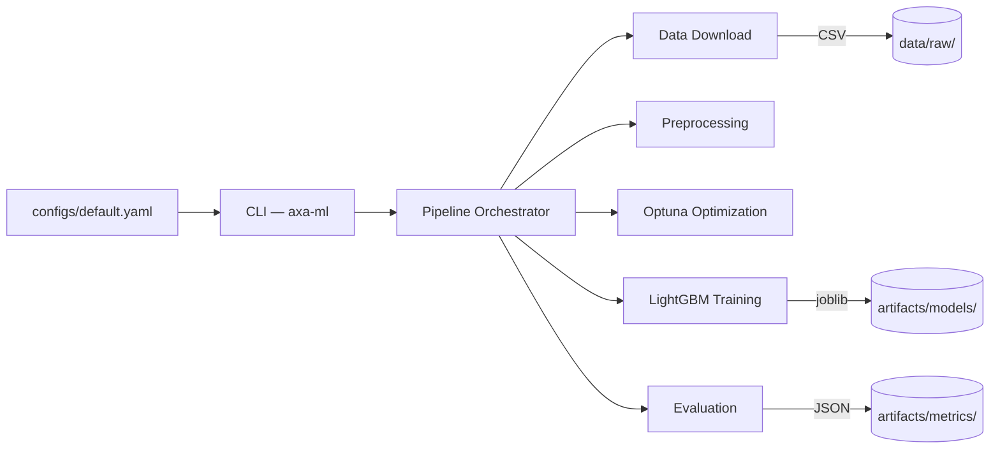

# AXA ML — Insurance Claims Classification Pipeline

A production-ready ML pipeline for binary classification of insurance claims, built as a modular Python package with CLI interface.

## Architecture



**Pipeline stages:**

1. **Download** — Fetches pg15training `.rda` dataset, converts to CSV (idempotent)
2. **Preprocess** — Creates binary target from `Numtppd`, drops leakage columns, one-hot encodes categoricals
3. **Optimize** — Bayesian hyperparameter search with Optuna (seeded sampler for reproducibility)
4. **Train** — Fits final LightGBM classifier with best parameters
5. **Evaluate** — Computes accuracy, precision, recall, F1 and persists as JSON

## Project Structure

```
├── configs/
│   └── default.yaml            # All tunable parameters
├── data/raw/                   # Downloaded CSV (gitignored)
├── artifacts/
│   ├── metrics/                # JSON evaluation results
│   └── models/                 # Serialized models (joblib)
├── notebooks/
│   └── modeling_starter.ipynb  # Original prototype
├── src/axa_ml/
│   ├── cli.py                  # Typer CLI entry-point
│   ├── config.py               # Pydantic config models
│   ├── pipeline.py             # Pipeline orchestrator
│   ├── data/
│   │   ├── download.py         # Dataset acquisition
│   │   └── preprocessing.py    # Feature engineering
│   └── model/
│       ├── train.py            # Optuna + LightGBM
│       └── evaluate.py         # Metrics computation
├── tests/                      # Unit + integration tests
├── Dockerfile
├── pyproject.toml              # Dependencies + tool config
└── uv.lock                    # Deterministic dependency lock
```

## Quickstart

### Prerequisites

- Python ≥ 3.11
- [uv](https://docs.astral.sh/uv/getting-started/installation/) (recommended) or pip

### Setup

```bash
# Clone the repository
git clone <repo-url> && cd AXA_IT

# Install all dependencies (creates .venv automatically)
uv sync

# Verify installation
uv run axa-ml --help
```

### Run the Full Pipeline

```bash
uv run axa-ml run
```

This downloads the dataset, preprocesses it, optimizes hyperparameters, trains the model, and saves metrics + model artifacts.

### Docker

```bash
docker build -t axa-ml .
docker run --rm axa-ml run
```

## CLI Reference

| Command | Description |
|---|---|
| `axa-ml run` | Run the full pipeline end-to-end |
| `axa-ml download` | Download the dataset only |
| `axa-ml train` | Train the model (data must exist) |
| `axa-ml evaluate` | Evaluate a saved model on the test set |

All commands accept `--config / -c` to specify a YAML config file (default: `configs/default.yaml`).

```bash
# Run with a custom config
uv run axa-ml run --config configs/experiment_v2.yaml

# Force re-download
uv run axa-ml download --force
```

## Configuration

All parameters are externalized in `configs/default.yaml`. To tweak an experiment, edit the file or create a copy:

```yaml
model:
  test_size: 0.2
  random_seed: 42        # Controls all random state
  n_trials: 50           # More Optuna trials
  hyperparameter_space:
    n_estimators: [50, 500]
    learning_rate: [0.001, 0.1]
    # ... other bounds
```

No Python code changes are needed to adjust parameters, data sources, or output paths.

## Testing

```bash
# Run all tests
uv run pytest

# Run with coverage report
uv run pytest --cov=axa_ml --cov-report=term-missing

# Run only unit tests (skip integration)
uv run pytest -m "not integration"

# Run only integration tests
uv run pytest -m integration
```

Current coverage: **67%** (target: ≥50%).

## Linting & Formatting

```bash
uv run ruff check src/ tests/
uv run ruff format --check src/ tests/
```


