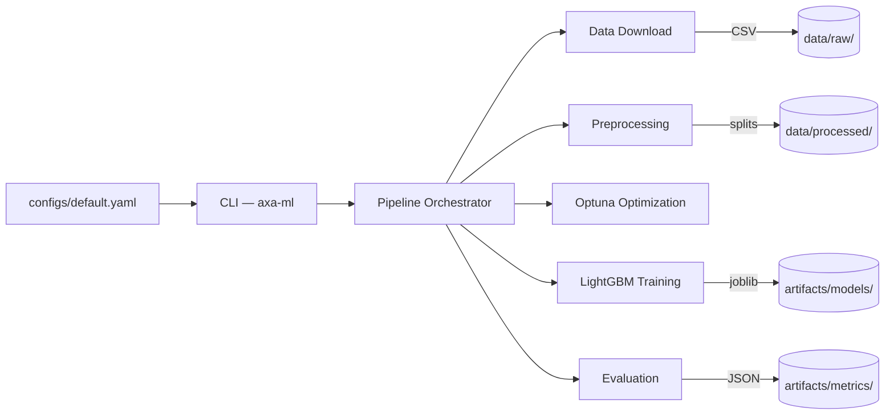

# AXA ML — Insurance Claims Classification Pipeline

A production-ready ML pipeline for binary classification of insurance claims, built as a modular Python package with CLI interface.

## Architecture



**Pipeline stages:**

1. **Download** — Fetches the `.rda` dataset, converts to CSV (idempotent)
2. **Preprocess** — Creates binary target from `Numtppd`, drops leakage columns, one-hot encodes categoricals
3. **Split** — Stratified train/test split, persisted to `data/processed/` for reproducible evaluation
4. **Optimize** — Bayesian hyperparameter search with Optuna (seeded sampler for reproducibility)
5. **Train** — Fits final LightGBM classifier with best parameters
6. **Evaluate** — Computes accuracy, precision, recall, F1, confusion matrix and persists as JSON

## Project Structure

```
├── configs/
│   └── default.yaml            # All tunable parameters
├── data/
│   ├── raw/                    # Downloaded CSV (gitignored)
│   └── processed/              # Persisted train/test splits (gitignored)
├── artifacts/
│   ├── metrics/                # JSON evaluation results
│   └── models/                 # Serialized models (joblib)
├── notebooks/
│   └── modeling_starter.ipynb  # Original prototype
├── src/axa_ml/
│   ├── cli.py                  # Typer CLI entry-point
│   ├── config.py               # Pydantic config models
│   ├── pipeline.py             # Pipeline orchestrator + load_and_preprocess helper
│   ├── data/
│   │   ├── download.py         # Dataset acquisition
│   │   └── preprocessing.py    # Feature engineering, splitting, persistence
│   └── model/
│       ├── train.py            # Optuna + LightGBM
│       └── evaluate.py         # Metrics computation + confusion matrix
├── tests/                      # Unit + integration tests (90% coverage)
├── Dockerfile
├── pyproject.toml              # Dependencies + tool config
└── uv.lock                    # Deterministic dependency lock
```

## Quickstart

### Prerequisites

- Python ≥ 3.11
- [uv](https://docs.astral.sh/uv/getting-started/installation/) (recommended) or pip

### Setup

```bash
# Clone the repository
git clone <repo-url> && cd AXA_IT

# Install all dependencies (creates .venv automatically)
uv sync

# Verify installation
uv run axa-ml --help
```

### Run the Full Pipeline

```bash
uv run axa-ml run
```

This downloads the dataset, preprocesses it, optimizes hyperparameters, trains the model, and saves metrics + model artifacts.

### Docker

```bash
docker build -t axa-ml .
docker run --rm axa-ml run
```

## CLI Reference

| Command | Description |
|---|---|
| `axa-ml run` | Run the full pipeline end-to-end |
| `axa-ml download` | Download the dataset only |
| `axa-ml train` | Preprocess + train the model (data must exist) |
| `axa-ml evaluate` | Evaluate a saved model using persisted test splits |

All commands accept `--config / -c` to specify a YAML config file (default: `configs/default.yaml`).

```bash
# Run with a custom config
uv run axa-ml run --config configs/experiment_v2.yaml

# Force re-download
uv run axa-ml download --force
```

## Configuration

All parameters are externalized in `configs/default.yaml`. To tweak an experiment, edit the file or create a copy:

```yaml
data:
  url: "https://..."
  dataset_filename: "pg15training.csv"  # Configurable dataset name
  rda_key: "pg15training"               # Key in the .rda archive

model:
  test_size: 0.2
  random_seed: 42        # Controls all random state
  n_trials: 50           # More Optuna trials
  hyperparameter_space:
    n_estimators: [50, 500]
    learning_rate: [0.001, 0.1]
    # ... other bounds
```

No Python code changes are needed to adjust parameters, data sources, or output paths.

## Testing

```bash
# Run all tests
uv run pytest

# Run with coverage report
uv run pytest --cov=axa_ml --cov-report=term-missing

# Run only unit tests (skip integration)
uv run pytest -m "not integration"

# Run only integration tests
uv run pytest -m integration
```

Current coverage: **90%** (target: ≥50%).

## Linting, Formatting & Type Checking

```bash
# Lint
uv run ruff check src/ tests/

# Format check
uv run ruff format --check src/ tests/

# Type check
uv run pyright
```

## Reproducibility

- **Deterministic dependencies**: `uv.lock` pins every transitive dependency
- **Seeded randomness**: All random operations use `config.model.random_seed` (global seeds + per-component seeds)
- **Deterministic training**: `n_jobs=1` in LightGBM ensures thread-ordering does not introduce non-determinism
- **Stratified splitting**: Train/test split preserves class distribution for imbalanced datasets
- **Persisted splits**: Train/test data is saved to `data/processed/` so that `evaluate` uses the exact same data as `train`
- **Docker**: Multi-stage Dockerfile reproduces the full runtime environment

## Tooling Choices

| Tool | Why |
|---|---|
| **uv** | Fast dependency resolver, deterministic lock file, replaces pip/virtualenv |
| **Ruff** | Single Rust-based linter+formatter, replaces flake8+isort+black |
| **Pyright** | Fast static type checker, catches type errors early |
| **pytest** | Industry-standard testing with rich plugin ecosystem |
| **Pydantic** | Type-safe config validation, prevents silent misconfiguration |
| **Typer** | Minimal-boilerplate CLI framework with auto-generated help |
| **LightGBM** | Fast, memory-efficient gradient boosting for tabular data |
| **Optuna** | State-of-the-art Bayesian hyperparameter optimization |
| **structlog** | Structured logging, switchable between dev console and production JSON format |

> **Why not Airflow/Kedro/ZenML?** The pipeline is a single-model, single-shot training job. These frameworks add scheduling/registry/scaffolding infrastructure that would be disproportionate. The modular `src/` layout maps naturally onto DAG tasks if production orchestration is needed later.
